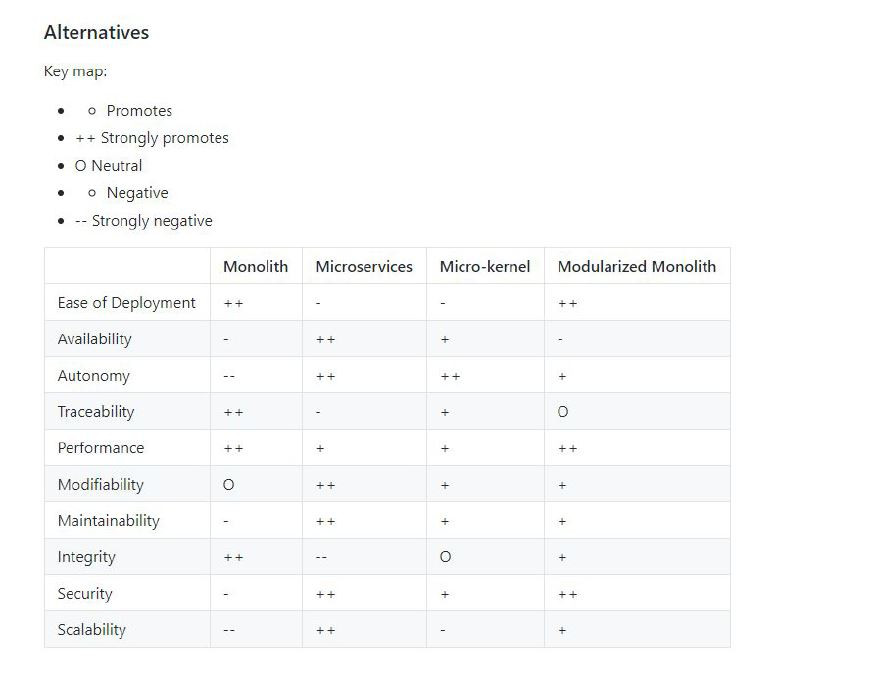

# Системный подход

## Контекст
Нужно выбрать архитектуру для уже используемых приложений

### Альтернативы:
 
 
## Решение

В соответствии с альтернативами в контексте бизнеса и команды разработки, будем опираться на модульный монолит

## Статус

Отложено

## Последствия

 

 

