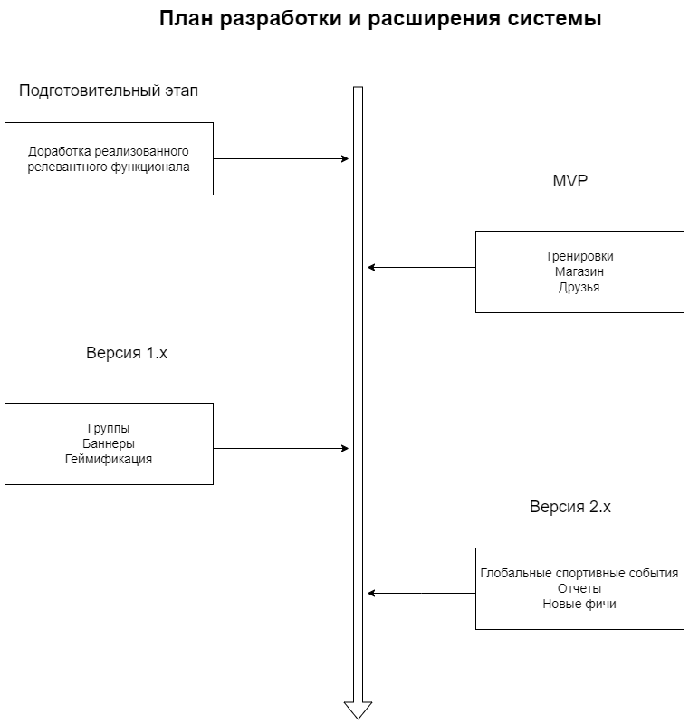
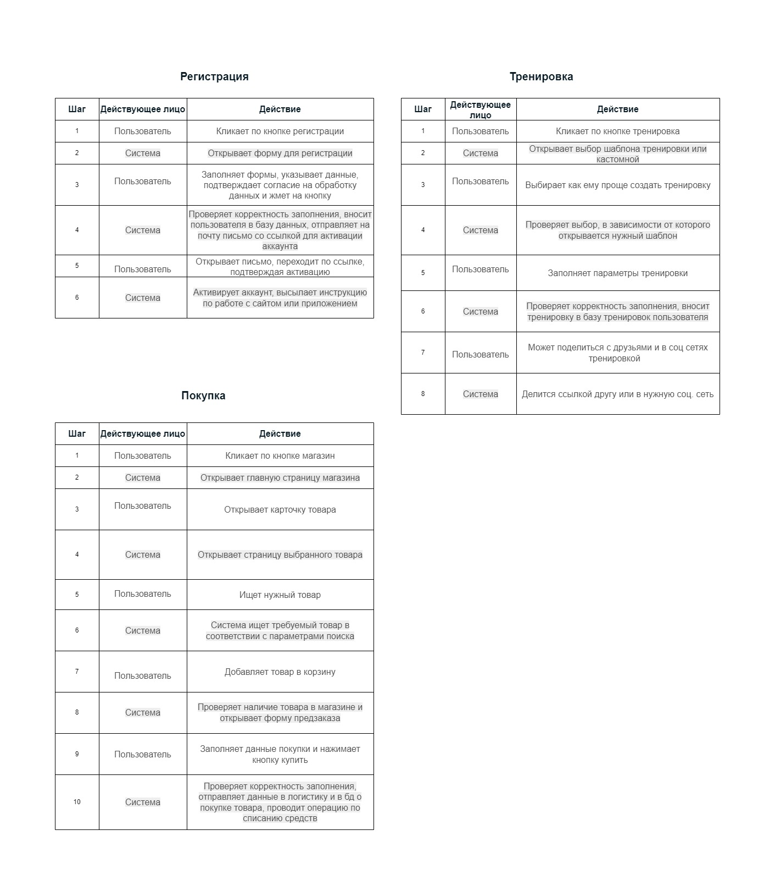

# Архитектура ПО спортивной компании

Оглавление:
* [Бизнес цели](#bussiness)
* [Функциональные требования](#functions)
* [Стейкхолдеры](#stakeholders)
* [Концептуальная архитектура](#concept)
* [Риски реализации](#risks)
* [План разработки системы](#plan)
* [Критические бизнес-сценарии](#scenarios)
* [Атрибуты качества](#attributes)
* [Не функциональные требования](#nonfunctions)
* [Архитектурные опции](#options)
* [Architecture Decision Records](#adr)
* [Сценарии использования приложения](#use)
* [Базовая архитектура](#basicarc)

##  1. Бизнес цели
* Увеличение объема продаж
* Привлечение новых партнеров
* Реклама и популяризация бренда

##  2. Функциональные требования
* Внедрить функционал тренировок и рассписания
* Разработать поиск друзей
* Создать геймификацию
* Возможность легкой интеграции в стороннии МП и подключение сторонних устройств
* Реализация добавления промоакции, ленты новостей и уведомлений

##  3. Стейкхолдеры
* Руководитель проекта - интерес высокий
* Заказчик - интерес высокий
* Партнеры - интерес высокий
* Команда проекта - интерес средний
* Конечные пользователи - интерес низкий
* Конкуренты - интерес высокий
 
##  4. Концептуальная архитектура  
 

##  5. Риски реализации
- Бизнес
- Технические

##  6. План разработки системы
   

##  7. Критические бизнес-сценарии
* Тренировки - создание, история, сравнение результатов с собой, другими людьми
* Магазин с актуальными товарами и интеграцией с личным инвентарем
* Интеграция социальных компонентов, поиск людей по интересам
* Лента событий, промоакции

##  8. Атрибуты качества
* Удобство использования: тренировки, магазин, поиск людей
* Доступность: ПО не зависит от интернета, стабильная работа
* Безопасность: защита персональных данных

##  9. НФТ
* Магазин должен поддерживать возможность значительного расширения ассортимента
* Корзина магазина должна работать, даже если обработка займет больше времени
* Функционал тренировок и геймификации должен быть асинхронно настроен с интернетом
* Встроенные промо акции должны отображаться, даже в рандомном порядке
* Возможность добавить сервера для уменьшения времени отклика
* Доступ к бд должен быть даже если соединение медленное

##  10. Архитектурные опции
Принцип выбора для существующих ПО - отталкиваться от текущей архитектуры:
* Если монолит то постепенно переходить в сторону микросервисов
* Микросервисы - продолжать расширение

При создании новых приложений нужно отталкиваться от масштаба, функциональности и обвате аудитории:
* При локальной аудитории можно начать с модульного монолита и по мере расширения переходить к микросервисам
* При глобальном проекте можно начинать сразу с микросервиса

##  11. Architecture Decision Records
* [001_template](ADR/001_template.md)
* [002_системный_подход](ADR/002_approach.md)
  
##  12. Сценарии использования приложения

##  13. Базовая архитектура

 

 

