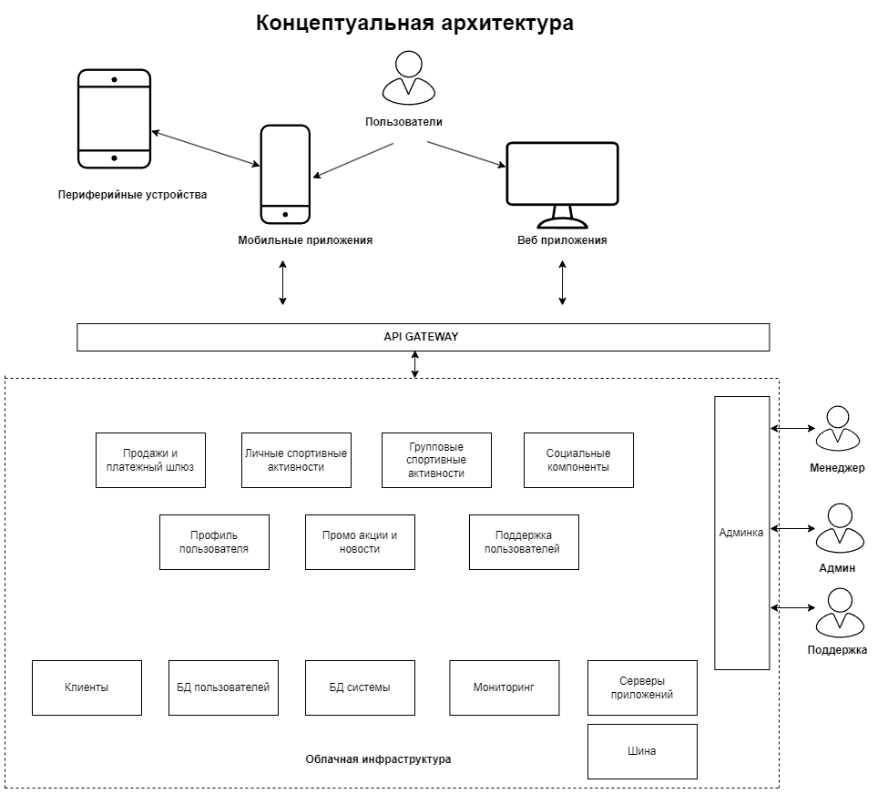
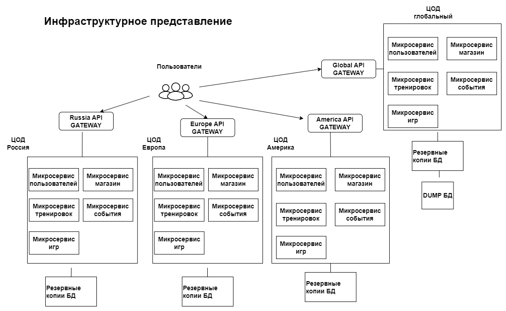

# Архитектура ПО спортивной компании

Оглавление:
* [Бизнес цели](#bussiness)
* [Функциональные требования](#functions)
* [Стейкхолдеры](#stakeholders)
* [Концептуальная архитектура](#concept)
* [Риски реализации](#risks)
* [План разработки системы](#plan)
* [Критические бизнес-сценарии](#scenarios)
* [Атрибуты качества](#attributes)
* [Не функциональные требования](#nonfunctions)
* [Архитектурные опции](#options)
* [Architecture Decision Records](#adr)
* [Сценарии использования приложения](#use)
* [Базовая архитектура](#basicarc)
* [Основные представления](#presentations)
* [Анализ рисков](#risks)
* [Стоимость владения](#ownership)

##  1. Бизнес цели
* Увеличение объема продаж
* Привлечение новых партнеров
* Реклама и популяризация бренда

##  2. Функциональные требования
### Домен пользователей
Система должна обеспечивать возможность:
* Использовать функционал друзей
* Производить поиск друзей пользователя по имени и фамилии
* Создавать и редактировать свой профиль
* Делиться своим профилем и импортировать из существующих профилей в МП компании
* Настраивать платежи в профиле
### Домен тренировок
Система должна обеспечивать возможность:
* Создать, редактировать и удалять тренировки
* Создавать, редактировать и удалять рассписания тренировок
* Создавать, редактировать и удалять спортивный инвентарь
* Сравнивать тренировки с прошлыми, других людей, друзей, профессиональными спортсменами
* Подключить сторонние устройства для отслеживания тренировок
### Домен спортивных событий
Система должна обеспечивать возможность:
* Создать, управлять и удалять группы пользователей
* Производить поиск людей по схожим интересам, тренерующимся в одном месте, для формирования групп для совместных занятий
* Добавления региональных и глобальных промоакции
* Отображать ленту новостей и спортивных событий
* Уведомления друзей о ваших новых успехах и со стороны МП
### Домен магазина
Система должна обеспечивать возможность:
* Отображать карточки товаров
* Сортировать товар
* Добавление товара в корзину
* Добавление модуля склада для проверки доступности товара
* Прозразчости состояния заказа
* Выбор способов доставки, отображения ориентировочной даты и времени привоза товара
### Домен геймификации
Система должна обеспечивать возможность:
* Добавлять промоакции в игры
* Интегрировать с платежами
* Добавлять игры в избранное
* Делиться результатами с друзьями, приглашать друзей
* Создавать кооперативные сессии
##  3. Стейкхолдеры
* Руководитель проекта - интерес высокий
* Заказчик - интерес высокий
* Партнеры - интерес высокий
* Команда проекта - интерес средний
* Конечные пользователи - интерес низкий
* Конкуренты - интерес высокий
 
##  4. Концептуальная архитектура  
 

##  5. Риски реализации
- Бизнес
- Технические

##  6. План разработки системы
   

##  7. Критические бизнес-сценарии
* Тренировки - создание, история, сравнение результатов с собой, другими людьми
* Магазин с актуальными товарами и интеграцией с личным инвентарем
* Интеграция социальных компонентов, поиск людей по интересам
* Лента событий, промоакции

##  8. Атрибуты качества
* Удобство использования: тренировки, магазин, поиск людей
* Доступность: ПО не зависит от интернета, стабильная работа
* Безопасность: защита персональных данных

##  9. НФТ
### Домен пользователей
* Доступ к бд профиля пользователя и поиску друзей должен быть даже если соединение медленное
* Возможность усилить безопасность бд пользователей при необходимости
* Асинхронно и синхронно настроить функционал платежей по сложной логике
* Поддержка разных способов оплаты и интеграции любыми платежными системами
* Возможность добавить сервера для уменьшения времени отклика
### Домен тренировок
* Функционал тренировок должен быть асинхронно настроен с интернетом
* Возможность расширения списка поддержки сторонних устройств и приложений
* Возможность использования кастомных фичей с определенными внешними устройствами
* Усилить безопасность при интеграции с сторонними устройствами
* Добавление купленного в магазине инвентаря должно работать при медленном интернете
### Домен спортивных событий
* Встроенные промо акции должны отображаться, даже в рандомном порядке
* Возможность расширения отображаемых событий в ленте новостей
* Уведомления друзей асинхронно настроено с интернетом
* Создавать черновик при создании групп и архив при удалении
* Добавление персональных акций
### Домен магазина
* Магазин должен поддерживать возможность значительного расширения ассортимента
* Корзина магазина должна работать, даже если обработка займет больше времени
* Форма для доставки должна отправляться, даже если это займет больше времени
* Возможность добавить сервера для уменьшения времени отклика
* Возможность выбрать несколько служб доставки
### Домен геймификации
* Функционал геймификации должен быть асинхронно настроен с интернетом
* Возможность усиления безопасности в интеграции с платежами в профиле пользователя
* Промоакции в разделе игры должны отображаться даже без интернета
* Возможность добавить сервера для уменьшения времени отклика
* Реализация поддержки игры в кооперативе через wi-fi

##  10. Архитектурные опции
Принцип выбора для существующих ПО - отталкиваться от текущей архитектуры:
* Если монолит то постепенно переходить в сторону микросервисов
* Микросервисы - продолжать расширение

При создании новых приложений нужно отталкиваться от масштаба, функциональности и обвате аудитории:
* При локальной аудитории можно начать с модульного монолита и по мере расширения переходить к микросервисам
* При глобальном проекте можно начинать сразу с микросервиса

##  11. Architecture Decision Records
* [001_template](ADR/001_template.md)
* [002_системный_подход](ADR/002_approach.md)
  
##  12. Сценарии использования приложения

##  13. Базовая архитектура

##  14. Основные представления

##  15. Анализ рисков
* Бизнес риски - требуется продвижение и поддержка бренда
* Правовые риски - зависимость от законодательства разных стран, от локальных контрагентов
* Стратегические риски- партнеры
* Технические риски:
Нагрузка на приложение с учетом глобальных событий
Разные языки и часовые пояса команд
Интеграция со сторонними приложениями/устройствами

##  16. Стоимость владения

 

 

